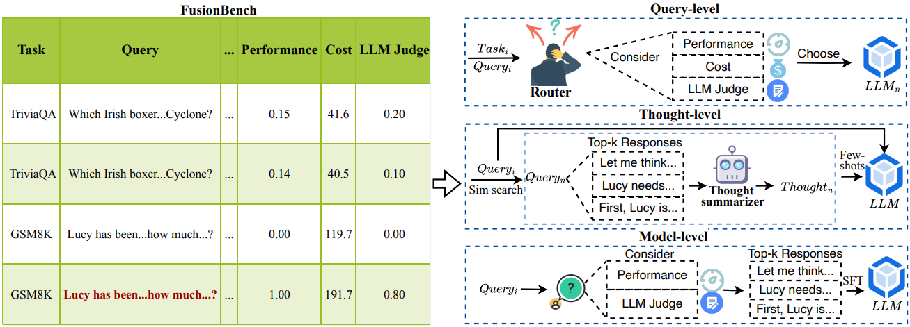

# Fusing LLM Capabilities with Routing Data

<p align="center">
    <a href="https://ulab-uiuc.github.io/FusionBench/">
        
    </a>
    <a href="http://arxiv.org/abs/xxxx.xxxxx">
        
    </a>
    <!-- <a href="xxx">
        
    </a> -->
    <a href="https://github.com/ulab-uiuc/FusionBench/blob/master/LICENSE">
        
    </a>
    <br>
    <a href="https://github.com/ulab-uiuc/FusionBench">
        
    </a>
    <a href="https://github.com/ulab-uiuc/FusionBench">
        
    </a>
    <a href="https://github.com/ulab-uiuc/FusionBench">
        
    </a>
</p>


<p align="center">
    <a href="https://ulab-uiuc.github.io/FusionBench/">🌐 Project Page</a> |
    <a href="http://arxiv.org/abs/xxxx.xxxxx">📜 arXiv</a>
    <!-- <a href="xxx">📮 Twitter Post</a> -->
<p>


<div align="center">
  
  <p><b>Overview of LLM capability fusion via FusionBence with three representative levels: Query-level, Thought-level, and Model-level.</b></p>
</div>


## News

**[2025.06]** 🌟 **FusionBench** was released.


## 🛠️Environment Setup

```bash
conda create -n fusionbench python=3.9
conda activate fusionbench
pip install pandas
pip install datasets
pip install tqdm
pip install transformers
pip install litellm
pip install sentence_transformers
pip install torch
pip install numpy
```


## 🎯Data Process

Run the following command to start data collection.

```bash
# split: train OR test
python data_process/data_combine.py --split train --case_num 500 --round 5
```


## 📊Experiments


### Query-level Fusion

First, run the data preprocessing script to prepare the dataset:

```bash
# Preprocess the dataset and generate training/testing files
python query_level/data_processing.py
```

For more detailed information about the data preprocessing and model training process, please refer to the specific README in the `query_level` directory.


### Thought-level Fusion
First, run the data preprocessing script to prepare the thought prompts:

```bash
# Preprocess the dataset and generate training/testing files
python query_level/data_processing.py
```

Or run the script to directly use Huggingface datasets to generate thought-enhanced queries

```bash
python thought_level/get_thought_prompt.py
```

For more detailed information about the data preprocessing and model training process, please refer to the specific README in the `thought_level` directory.


### Model-level Fusion


Run the following command to generate SFT data for model-level fusion.

```bash
# setting: perf, judge, hybrid, baseline
python model_level/sft_data_gen.py --settin perf --k 5 --save_path [YOUR_PATH] --csv_path_with_judge [YOUR_PATH]

python model_level/sft_test_gen.py --save_path [YOUR_PATH] --csv_path [YOUR_PATH]
```


You can refer to [LLaMA-Factory](https://github.com/hiyouga/LLaMA-Factory) for detailed instructions to start fine-tuning on model-level fusion data.


## Citation

```bibtex
@article{FusionBench,
  title={Fusing LLM Capabilities with Routing Data},
  author={Tao Feng and Haozhen Zhang and Zijie Lei and Pengrui Han and Mostofa Patwary and Mohammad Shoeybi and Bryan Catanzaro and Jiaxuan You},
  journal={arXiv preprint arXiv:xxxx.xxxxx},
  year={2025}
}
```
